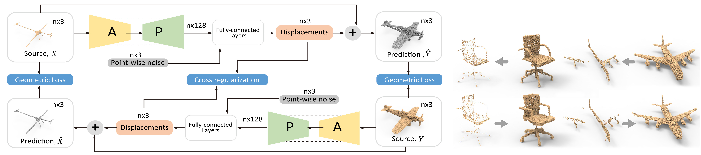

### <a href="https://kangxue.org/P2P-NET.html"> P2P-NET: *Bidirectional Point Displacement Net for Shape Transform*</a>
<a href="http://kangxue.org">Kangxue Yin</a>, <a href="http://vcc.szu.edu.cn/~huihuang/">Hui Huang</a>, <a href="http://www.cs.tau.ac.il/~dcor/">Daniel Cohen-Or</a>, <a href="https://www.cs.sfu.ca/~haoz/">Hao Zhang</a>.

P2P-NET is a general-purpose deep neural network which learns geometric transformations between point-based shape representations from two domains, e.g., meso-skeletons and surfaces, partial and complete scans, etc.
The architecture of the P2P-NET is that of a bi-directional point displacement network, which transforms a source point set to a target point set with the same cardinality, and vice versa, by applying point-wise displacement vectors learned from data. 
P2P-NET is trained on paired shapes from the source and target domains, but without relying on point-to-point correspondences between the source and target point sets...  [<a href="https://arxiv.org/abs/1803.09263">more in the paper</a>].

### Prerequisites

- Linux (tested under Ubuntu 16.04 )
- Python (tested under 2.7)
- TensorFlow (tested under 1.3.0-GPU )
- numpy, h5py

The code is built on the top of 
<a href="https://github.com/charlesq34/pointnet2">PointNET++</a>.  Before run the code, please compile the   customized TensorFlow operators of PointNet++ under the folder "pointnet\_plusplus/tf\_ops".

### Dataset

- Download dataset compressed in HDF5:
 <a href="https://drive.google.com/uc?id=1LF0tmJERXXSsF8z8T23Sg87ilSCXOXdB&export=download">HERE</a>.
- Download raw obj and ply files:
 <a href="https://drive.google.com/uc?id=1VUSJtcn_-lWER-_VkjWhlNMQvlpgjUEi&export=download">HERE</a>.

If you are in China, you can also choose to download them from Weiyun:
<a href="https://share.weiyun.com/5RrG084">HDF5</a>,
<a href="https://share.weiyun.com/5xbVwaf">Raw</a>.

### Usage

An example of training P2P-NET 
 
(to learn transformations between point-based skeletons and point-based surfaces with the airplane dataset.)

	python -u run.py --mode=train  --train_hdf5='data_hdf5/airplane_train.hdf5'   --test_hdf5='data_hdf5/airplane_test.hdf5' --domain_A=skeleton --domain_B=surface  --gpu=0

Test the model:

	python -u run.py --mode=test  --train_hdf5='data_hdf5/airplane_train.hdf5'   --test_hdf5='data_hdf5/airplane_test.hdf5' --domain_A=skeleton --domain_B=surface  --gpu=0 --checkpoint='output_airplane_skeleton-surface/trained_models/epoch_200.ckpt'

### Citation
If you find our work useful in your research, please consider citing:

    @article {yin2018p2pnet,
      author = {Kangxue Yin and Hui Huang and Daniel Cohen-Or and Hao Zhang},
      title = {P2P-NET: Bidirectional Point Displacement Net for Shape Transform},
      journal = {ACM Transactions on Graphics(Special Issue of SIGGRAPH)},
      volume = {37},
      number = {4},
      pages = {152:1--152:13},
      year = {2018}
    }

### Acknowledgments
The code is built on the top of 
<a href="https://github.com/charlesq34/pointnet2">PointNET++</a>. 
Thanks for the precedent contribution.

